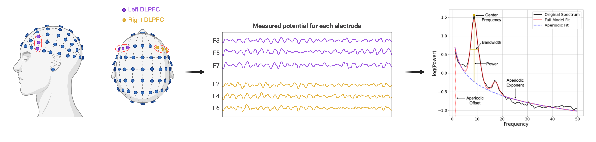

<br>

# Aperiodic EEG and 7T MRSI evidence for maturation of E/I balance supporting the development of working memory through adolescence

*Adolescence has been hypothesized to be a critical period for the development of human association cortex and higher-order cognition. A defining feature of critical period development is a shift in the excitation: inhibition (E/I) balance of neural circuitry, however how changes in E/I may enhance cortical circuit function to support maturational improvements in cognitive capacities is not known. Harnessing ultra-high field 7 T MR spectroscopy and EEG in a large, longitudinal cohort of youth (N = 164, ages 10–32 years old, 347 neuroimaging sessions), we delineate biologically specific associations between age-related changes in excitatory glutamate and inhibitory GABA neurotransmitters and EEG-derived measures of aperiodic neural activity reflective of E/I balance in prefrontal association cortex.*

### Project Lead
Shane D. McKeon

### Faculty Lead
Beatriz Luna 

### Project Start Date
January 2023

### Current Project Status
Published in Developmental Cognitive Neuroscience (2024) as [Aperiodic EEG and 7T MRSI evidence for maturation of E/I balance supporting the development of working memory through adolescence](https://www.sciencedirect.com/science/article/pii/S1878929324000343)

### Datasets
LNCD 7T

### Github Repository
https://github.com/LabNeuroCogDevel/7T_EEG/tree/main/Aperiodic_MRS_Development

## Code Documentation
**Preprocessing:**

Preprocessing can be run using [01_Aperiodic_Preprocessing.sh](/LabNeuroCogDevel/7T_EEG/blob/main/Aperiodic_MRS_Development/01_Aperiodic_Preprocessing.sh)

  ```matlab -nodesktop -r "addpath(genpath('../Preprocessing_Functions/')); run_preprocessing_pipeline('Resting_State')" ```
  
* Initial preprocessing was done using matlab code run_preprocessing_pipeline.m (../Preprocessing_Functions) which first pulls in raw data from 'Raw/EEG/7TBrainMech'.
* Set the task as 'Resting_State' to select the resting state data.
* Bandpass filter between 0.5 Hz and 70 Hz
* Downsamples the data from 1024Hz to 150 Hz
* Removes bad channels (the following criterion is used)
  - arg_flatline: 8
    - Maximum tolerated flatline duration. In seconds. If a channel has a longer flatline than this, it will be considered abnormal.
  - arg_highpass: [0.25 0.75]
    - Transition band for the initial high-pass filter in Hz. This is formatted as [transition-start, transition-end]
  - arg_channel: 0.7
    - Minimum channel correlation. If a channel is correlated at less than this value to a reconstruction of it based on other channels, it is considered abnormal in the given time window. This method requires that channel locations are available and roughly correct; otherwise a fallback criterion will be used.
  - arg_noisy: 5
    - If a channel has more line noise relative to its signal than this value, in standard deviations based on the total channel population, it is considered abnormal.
  - arg_burst: 15
    - Standard deviation cutoff for removal of bursts (via ASR). Data portions whose variance is larger than this threshold relative to the calibration data are considered missing data and will be removed. 
  - arg_window: 0.3
    - Criterion for removing time windows that were not repaired completely. This may happen if the artifact in a window was composed of too many simultaneous uncorrelated sources (for example, extreme movements such as jumps). This is the maximum fraction of contaminated channels that are tolerated in the final output data for each considered window.
* Interpolates missing channels
  - Dataset includes a few subjects that used a 128 cap as opposed to a 64 channel cap. The code removes the 4 channels that are found in 128 but not 64 and reinterpolates the missing channels that were removed from above
* Run ICA to identify eye movements and blinks
* Homogenize Channel locations
  - Read in the channel locations and make sure all files have the correct locations, especially the few subjects who were ran using a 128 channel cap
* Filter out 60 Hz artifact from line noise

<br> 

**Calculate the Aperiodic Activity**

This work was done using the FOOOF package (previous to new edition SpecParam) using [02_runFOOOF.py](https://github.com/LabNeuroCogDevel/7T_EEG/blob/main/Aperiodic_MRS_Development/02_runFOOOF.py) using the following parameters: <br>
* For compute_psd ```(method='welch', fmin=1, fmax=50, tmin=0, tmax=None, picks='all', n_fft=256, n_overlap=128, window='hamming')``` 
* For FOOOFGroup ```peak_width_limits=[0.5, 12], min_peak_height=0, peak_threshold=2, aperiodic_mode='fixed', max_n_peaks=4, verbose=False```
* Frequency range to fit [1, 50]
* The python code will extract the aperiodic measures in a npz file for each participant

Power spectral density (PSD) was calculated separately for each participant and electrode, corresponding to the left and right DLPFC (Right: F4, F6, F8; Left: F3, F5, F7), across the continuous resting state EEG using Welch’s method implemented in MATLAB (2 s Hamming window, 50% overlap). The Fitting Oscillations and One Over f (FOOOF) python toolbox (version 1.0.0; https://fooof-tools.github.io/fooof/), now known as Spectral Parametrization (specparam), was used to characterize the PSD as a combination of an aperiodic component with overlying period components, or oscillations (Donoghue et al., 2020a). Oscillations were characterized as frequency regions with power above the aperiodic component, modeled as a Gaussian, and are referred to as ‘peaks’. The aperiodic component was extracted from the 1–50 Hz frequency range of each power spectrum (aperiodic_mode = ‘fixed’, peak_width_limits = [0.5, 12], min _peak_height = 0, peak_threshold = 2, max _n_peaks = 4, default settings otherwise). We used the ‘fixed’ setting as we did not expect a “knee” in the power spectrum. This assumption was supported upon visual inspection of each PSD.



<br> 

**Extract Aperiodic Measures from Individual Files**

[03_ExtractFOOOFmeasures.py](https://github.com/LabNeuroCogDevel/7T_EEG/blob/main/Aperiodic_MRS_Development/03_ExtractFOOOFmeasures.py) will load in each individual persons npz files and select the desired measures (exponent, offset, error and/or peak information) and save out one csv file with all subject, all channel information. This information is then loaded into merge7T by Will Foran

<br>

**Create Dataframes for Paper Analyses** 

[04_CreateFOOOFdataframes.R](https://github.com/LabNeuroCogDevel/7T_EEG/blob/main/Aperiodic_MRS_Development/04_CreateFOOOFdataframes.R) loads in the merge7T file and extracts out the wanted ages, fooof info, behavioral, and MRS measures that will be used to create figures and statistics for publication. Note, MRS and behavioral measures were previously calculated for these participants. 

<br>

**Figures and Statistics**

[05_RunStatistics.R](https://github.com/LabNeuroCogDevel/7T_EEG/blob/main/Aperiodic_MRS_Development/05_RunStatistics.R)

[06_FOOOFMRSPaperFigs.Rmd](https://github.com/LabNeuroCogDevel/7T_EEG/blob/main/Aperiodic_MRS_Development/06_FOOOFMRSPaperFigs.Rmd) 

To assess developmental trajectories of aperiodic activity, we implemented GAMMs on aperiodic parameter (exponent and offset), including random intercepts estimated for each participant. Regression splines were implemented (4 degrees of freedom) to assess linear and non-linear effects (Wood, 2017, Wood, 2013). We first tested for a main effect of age on aperiodic parameter while controlling for hemisphere (either ‘right’ or ‘left’ DLPFC) and condition (eyes open or eyes closed during resting state). We additionally tested for age-by-hemisphere interactions while controlling for condition, and age-by-condition interactions while controlling for region. Correlations between the exponent and the offset, for both the eyes open and eyes closed conditions were calculated using Pearson correlations.

To assess age-related change in the Glu/GABA ratio and the Glu-GABA asymmetry in right and left DLPFC, we used GAMM models, including random intercepts estimated for each participant. Regression splines were implemented (4 degrees of freedom) to assess linear and non-linear effects (Wood, 2017, Wood, 2013). We first tested for a main effect of age on the MRS measure while controlling for hemisphere (either ‘right’ or ‘left’ DLPFC), and perfect grey matter from the MRI voxel. We additionally tested for age-by-hemisphere interactions while controlling for fraction of grey matter. For further analysis, fraction of gray matter in the voxel was residualized out of MRSI estimates to control for the effect of gray matter.

We next investigated the relationship between the individual aperiodic parameters (exponent and offset) on MRSI-derived measures of the Glu-GABA asymmetry using linear mixed effect models (lmer function, lme4 package in Rstudio (Bates et al., 2015)). Using AIC, we determined an inverse age (age−1) model was more appropriate for both the exponent vs MRS and offset vs MRS associations, thus each model controlled for inverse age. We first tested for significant main effects of the MRS measure on the aperiodic parameter while controlling for age−1, condition (eyes open or eyes closed), and hemisphere (left or right DLPFC). We additionally tested for MRS-by-age−1 interactions while controlling for hemisphere and condition. To account for the four aperiodic measures, Bonferroni correction was used for multiple comparisons at pbonferroni = 0.012. To test for relationships between the age-related differences in the MRS measures and age- related differences in the aperiodic measures, mediation analyses were implemented using the R package mediation (Tingley et al., 2014). Unstandardized indirect effects were computed for each of 1000 bootstrapped samples, and the 95% confidence interval was computed by determining the indirect effects at the 2.5th and 97.5th percentiles.

To assess associations between 1/f aperiodic parameters (exponent and offset), MGS behavioral measures (accuracy, accuracy variability, response latency, and response latency variability), and spatial span measure (maximum length of sequence), we used linear mixed effect models (lmer function, lme4 package in Rstudio (Bates et al., 2015)). Using AIC, we determined an inverse age (age−1) model was more appropriate for both the exponent vs behavior and offset vs behavior associations. We first tested for significant main effects of the behavioral measure on the aperiodic parameter while controlling for inverse age (age−1), condition (eyes open or eyes closed), and hemisphere (left of right DLPFC). We additionally tested for behavior-by-inverse age interactions while controlling for condition and hemisphere. Bonferroni correction was used for multiple comparisons.

To assess associations between MRS measures (asymmetry) and MGS behavioral measures (accuracy, accuracy variability, response latency, and response latency variability), and spatial span measure (maximum length of sequence), we used linear mixed effect models (lmer function, lme4 package in Rstudio (Bates et al., 2015)). Using AIC, we determined an inverse age model was best for the glutamate, GABA, and asymmetry vs behavioral associations. We first tested for significant main effects of the behavioral measure on the aperiodic parameter while controlling for age−1 and hemisphere (left of right DLPFC). We additionally tested for behavior-by-age interactions while controlling hemisphere. Bonferroni correction was used for multiple comparisons.

## Project Software
The following external software was used for this project: 

Python: scipy, matplotlib, mne, fooof, numpy, mpl_toolkits, os, pandas
<br>
R version 4.2.3: data.table, dplyr, knitr, ggplot2, e1071, caret, readxl, Hmisc, lmerTest, corrplot, cowplot, mgcv, tidyr
